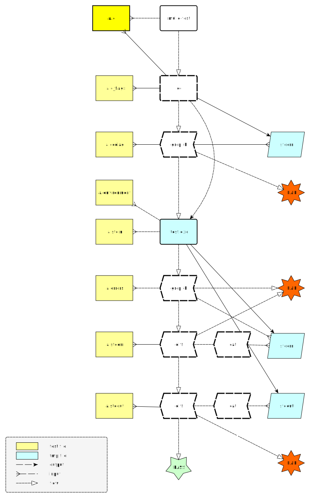

# ☑︎ Run tests and compare their results against expectations

... for Android, BSDs, Linux, macOS, SunOS, Windows (MinGW, WSL)

**mulle-test** can test your C or Objective C library. But it can also test
shell scripts or binaries. Basically anything that creates text output.

The loop **mulle-test** performs is *compile*, *execute*, *diff*. A test always
fails, if the return code is not 0. A test also fails, if there is an expected
output file present, and the test output differs from it.

As you would manually:

``` bash
cc -o a.out a.c
./a.out > a.result
diff a.stdout a.result
```

| Release Version                                       | Release Notes
|-------------------------------------------------------|--------------
|   | [RELEASENOTES](RELEASENOTES.md) |


## Writing a test

Here is a simple test, that checks that "Hello World" is properly output.
It consists of a sourcefile `example.c` and the expected test output file
`example.stdout`:

``` bash
mkdir test
cd test
mkdir example

cat <<EOF > example/example.c
#include <stdio.h>

main()
{
   printf( "Hello World\n");
   return( 0);   // important!
}
EOF

echo "Hello World" > example/example.stdout
```


## Testing with test support files

Run the test with `mulle-test`. The following graphic represents the control
flow and the operations performed to check if a test (in this case named "a.c")
passes or fails:



Test support files are optional. If a file is not present, the respective
matching operation is not performed.


| Extension            | Description
|----------------------|----------------------
| `<name>.stdout`      | Contents must match exactly standard output of the test executable
| `<name>.stdin`       | File fed to standard input of the test executable
| `<name>.stderr`      | Contents must match exactly standard error of the test executable
| `<name>.errors`      | Each line must grep for test diagnostics
| `<name>.ccdiag`      | Each line must grep for compiler diagnostics
| `<name>.environment` | Environment variables to set for test executable
| `<name>.cat`         | An executable or script to use instead of the default `cat`
| `<name>.diff`        | An executable or script to use instead of the default `diff`


If for a test there is no support file `<name>.<ext>` found, a file with the
name `default.<ext>` will be searched for instead.

### stdin, stdout, stderr

These files are treated as binaries. Changes in whitespace will be detected,
and will produce a warning.

### ccdiag

Each line is used as a pattern in an `grep -E` statement. An example file to
expect a compiler warning could be:

```
may not respond to
```

### errors

Usually a test that returns non-nil is assumed to have failed. If an `errors`
file is present, failure is the expected outcome. The contents of the file
are `grep -E`ed with the test output.


### environment

The contents of this file are loaded before executing the test.

Example:

``` bash
export FOO="1848"
```

### cat

This is an executable or script, that is used to massage output of the
test for diffing. Typical use is to sort the output to avoid differences due
to multi-threading or removing values that look like addresses.


### diff

This is an executable or script, that is used to compare the output of the
test with the expected files `stdout` and `stderr`. Typical use is to remove
some content before diffing such as:

```
#! /bin/sh
# remove all lines starting from "__DATE__" and ending with ");"
sed -e '/__DATE__/,/);/d'  | diff "$@"
```


## Technical info

**mulle-test** is based on **mulle-sde**. mulle-test compiles your project and
all dependencies as *shared* libraries. This is different from **mulle-sde**,
which compiles *static* libraries by default.


## Install

See [mulle-sde-developer](//github.com/mulle-sde/mulle-sde-developer) how to
install mulle-sde, which will also install mulle-test with required
dependencies.

The command to install only the latest mulle-test into
`/usr/local` (with **sudo**) is:

``` bash
curl -L 'https://github.com/mulle-sde/mulle-test/archive/latest.tar.gz' \
 | tar xfz - && cd 'mulle-test-latest' && sudo ./bin/installer /usr/local
```


## Author

[Nat!](https://mulle-kybernetik.com/weblog) for Mulle kybernetiK


